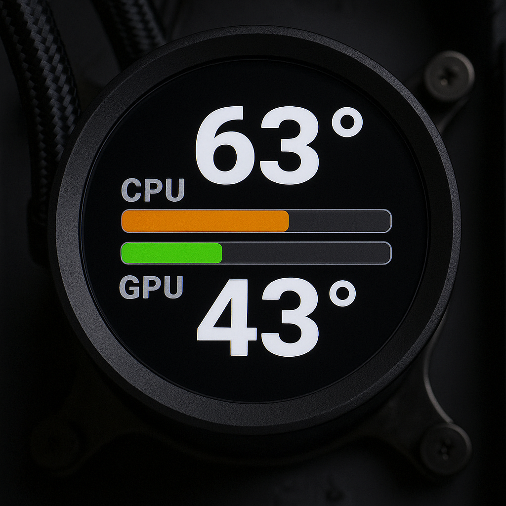
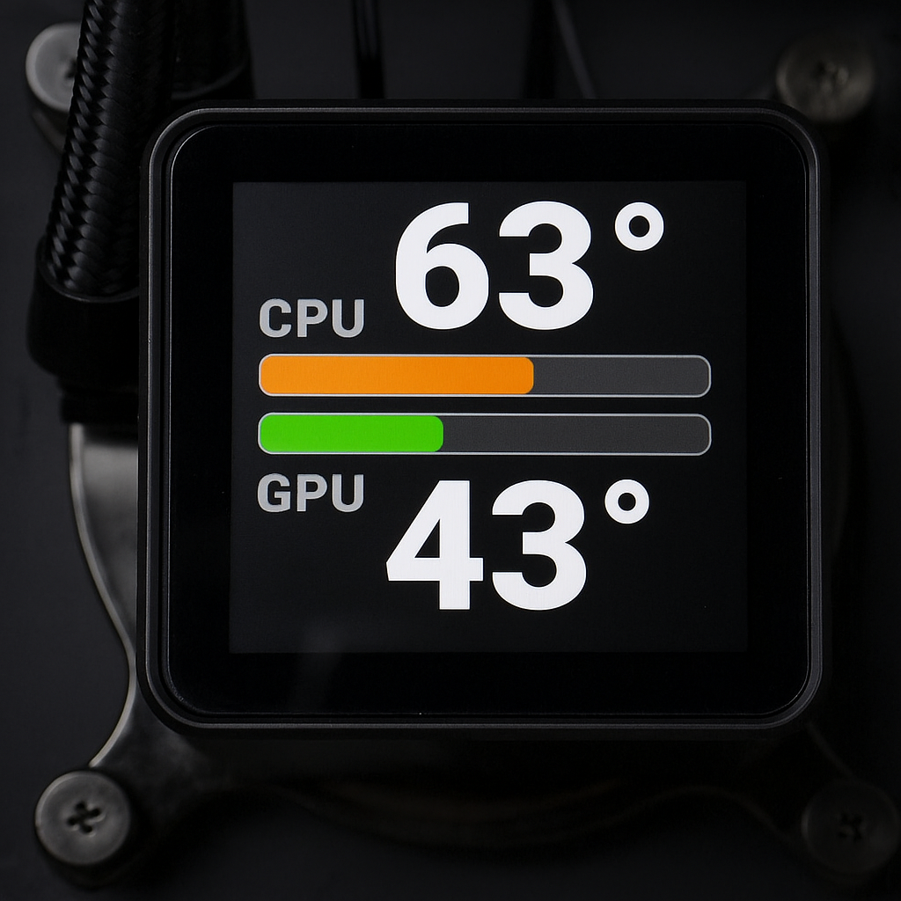

# CoolerDash 🐧


<p align="center">
  <a href="https://opensource.org/licenses/MIT"></a>
  <a href="https://kernel.org/"></a>
  <a href="https://en.wikipedia.org/wiki/C99"></a>
  <a href="https://app.codacy.com/gh/damachine/coolerdash/dashboard?utm_source=gh&utm_medium=referral&utm_content=&utm_campaign=Badge_grade"></a>
  <a href="https://github.com/damachine/coolerdash/actions/workflows/github-code-scanning/codeql"></a>
  <a href="https://github.com/damachine/coolerdash/actions/workflows/install.yml"></a>
  <a href="https://github.com/damachine/coolerdash/actions/workflows/aur.yml"></a>
  <a href="https://aur.archlinux.org/packages/coolerdash-git"></a>
  <a href="https://github.com/damachine/coolerdash/issues"></a>
  <a href="https://discord.com/channels/908873022105079848/1395236612677570560"></a>
  <a href="https://github.com/sponsors/damachine"></a>
</p>

## Description

#### CoolerDash enables real-time sensor monitoring of an AIO liquid cooler with integrated LCD displays. It extends the LCD functionality of [CoolerControl](https://gitlab.com/coolercontrol/coolercontrol) with additional features, support for additional sensor values, and a sophisticated, customizable user interface.

> ##### Special thanks to [@codifryed](https://github.com/codifryed), the founder of CoolerControl 

<a href="https://discord.com/channels/908873022105079848/1395236612677570560"></a>

<div align="center">
   
   
</div>

---

## System Requirements

- **OS**: Linux
- **CoolerControl**: Version >=2.2.2 REQUIRED - must be installed and running
- **CPU**: x86-64-v3 compatible (Intel Haswell+ 2013+ / AMD Excavator+ 2015+)
- **LCD**: LCD displays supported by CoolerControl **(Asus, Corsair, NZXT, etc.)**

> [!NOTE]
> See the [Supported Devices](https://github.com/damachine/coolerdash/blob/main/docs/devices.md), for a list of confirmed working hardware.  
> To confirm a device: [Submit a Device confirmation](https://github.com/damachine/coolerdash/issues/new?template=device-confirmation.yml).  
> In principle, all devices supported by [liquidctl](https://github.com/liquidctl/liquidctl?tab=readme-ov-file#supported-devices) should work with CoolerDash.  

---

## Prerequisites

1. **Install CoolerControl**: [Installation Guide](https://gitlab.com/coolercontrol/coolercontrol/-/blob/main/README.md)
2. **Start/Enable CoolerControl daemon**: `systemctl enable --now coolercontrold`
3. **In the CoolerControl settings, under `Device` and `Sensor`, select one sensor for the CPU and one for the GPU.**

> [!NOTE]
> Skip if you have already configured your CoolerControl before.

---

## Installation

#### Arch Linux (Recommended)

[](https://aur.archlinux.org/packages/coolerdash-git)

- Using an AUR helper:

```bash
# STEP 1: Install
yay -S coolerdash-git
#OR any other AUR helper

# STEP 2: Enable and start CoolerDash (after install or update)
systemctl daemon-reload
systemctl enable --now coolerdash.service
```

#### All Distributions

- Manual installation:

```bash
# STEP 1: Clone repository
git clone https://github.com/damachine/coolerdash.git
cd coolerdash

# STEP 2: Start CoolerControl daemon if not already running
systemctl start coolercontrold

# STEP 3: Build and install (auto-detects Linux distribution and installs dependencies)
make install

# STEP 4: Enable autostart
systemctl daemon-reload
systemctl enable --now coolerdash.service

# STEP 5: (optional) Check CoolerDash service status
systemctl status coolerdash.service
journalctl -u coolerdash.service
```

> [!CAUTION]
> For manual installations, please make sure all required dependencies are installed correctly.  
> Only package manager installations receive automatic updates.  
> At this time, manual installations need to be updated manually.

---

## Configuration

> [!NOTE]
> #### CoolerControl:  
> - In the CoolerControl settings, under **`Device`** and **`Sensor`**, select one sensor for the CPU and one for the GPU.
> - In CoolerControl GUI, set your LCD display to **`Image/gif`**.

> [!NOTE]
> #### CoolerDash Runtime:  
> - All settings are managed in `/etc/coolerdash/config.ini`.
> - After editing the config file, restart the service with `systemctl restart coolerdash.service` to apply your changes.

> [!TIP]
> - When CoolerDash stops (for example during system shutdown or reboot), it automatically displays the `shutdown.png` image from the install path. This happens because sensor data is no longer available at that point.
> - You can customize this and much more as you wish, by editing the `/etc/coolerdash/config.ini` file.
> - **For detailed configuration options and examples, see: 📖** [Configuration Guide](https://github.com/damachine/coolerdash/blob/main/docs/config.md)

---

## Usage

#### Service Management

```bash
# Service control
systemctl enable --now coolerdash.service   # Enable and Start!
systemctl start coolerdash.service          # Start
systemctl stop coolerdash.service           # Stop
systemctl restart coolerdash.service        # Restart
systemctl status coolerdash.service         # Status + recent logs

# Journal log
journalctl -u coolerdash.service

# Live logs
journalctl -xeu coolerdash.service -f
```

#### Build Commands

```bash
make            # Standard C99 build
make clean      # Clean up
make install    # System installation with dependency auto-detection
make uninstall  # Remove installation (service, binary, files)
make debug      # Debug build with AddressSanitizer
make help       # Show all options
```

#### Manual Usage 

```bash
# Run manually (with minimal status logging)
coolerdash

# Run with detailed debug logging
coolerdash --log
```

#### Debugging Steps

```bash
# 1. Check CoolerControl status
systemctl status coolercontrold
curl http://localhost:11987/devices

# 2. Test CoolerDash manually (with clean output)
coolerdash

# 3. Test CoolerDash with detailed debug logging
coolerdash --log

# 4. Debug build for detailed information (if needed)
make debug && coolerdash --log

# 5. Check service logs (STATUS messages always visible)
journalctl -xeu coolerdash.service -f

# 6. View recent logs with context
journalctl -u coolerdash.service -n 50
```

> [!NOTE]  
> The systemd service must be stopped before running manually to avoid conflicts:

```bash
systemctl stop coolerdash.service
```

---

## Troubleshooting

#### Common Issues

- **Device not found**: LCD not configured in CoolerControl → Use CoolerControl GUI → set LCD mode to `Image/gif` 
- **Connection refused**: CoolerControl daemon not running → `systemctl status coolercontrold`
- **Connection problem**: No devices found or wrong device UID  → Check CoolerControl configuration and LCD connection → Verify with `curl http://localhost:11987/devices | jq`

#### Solution:

- Manually check if devices are detected correctly:
```bash
# Start CoolerControl (if not running)
systemctl start coolercontrold

# Check available devices
curl http://localhost:11987/devices | jq
```
#### Example:
```json
{
      "name": "NZXT Kraken 2023",
      "type": "Liquidctl",
      "type_index": 1,
      "uid": "8d4becb03bca2a8e8d4213ac376a1094f39d2786f688549ad3b6a591c3affdf9",
      "lc_info": {
        "driver_type": "KrakenZ3",
        "firmware_version": "2.0.0",
        "unknown_asetek": false
      }
}
```

- **Manual Installation Conflicts**: If you see errors like "conflicting files" or "manual installation detected" during `makepkg -si`, this means CoolerDash was previously installed manually (via `make install`).

Solution:

- The PKGBUILD will attempt to clean up automatically.
- If problems persist, run:
  ```
  sudo make uninstall
  ```
- Remove any leftover files in `/opt/coolerdash/`, `/usr/bin/coolerdash`, and `/etc/systemd/system/coolerdash.service`.
- Then retry the installation.

> [!NOTE]
> If you need help, open an issue at [https://github.com/damachine/coolerdash/issues](https://github.com/damachine/coolerdash/issues)

---

## ⚠️ Disclaimer

This software is provided "as is", without warranty of any kind, express or implied.  
I do not guarantee that it will work as intended on your system. 

---

## 📄 License

MIT License - See LICENSE file for details.

[](https://opensource.org/licenses/MIT)

Individual Coolercontrol package have their own licenses:

See respective repositories at [https://gitlab.com/coolercontrol/coolercontrol](https://gitlab.com/coolercontrol/coolercontrol)

---

## 💝 Support the Project

If you find CoolerDash useful and want to support its development:

- ⭐ **Star this repository** on GitHub
- 🐛 **Report bugs** and suggest improvements
- 🔄 **Share** the project with others
- 📝 **Contribute** code or documentation
- [](https://github.com/sponsors/damachine)

> *🙏 Your support keeps this project alive and improving — thank you!.*

---

**👨‍💻 Developed by DAMACHINE** 
**📧 Contact:** [christkue79@gmail.com](mailto:christkue79@gmail.com) 
**🌐 Repository:** [GitHub](https://github.com/damachine/coolerdash) 
