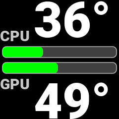
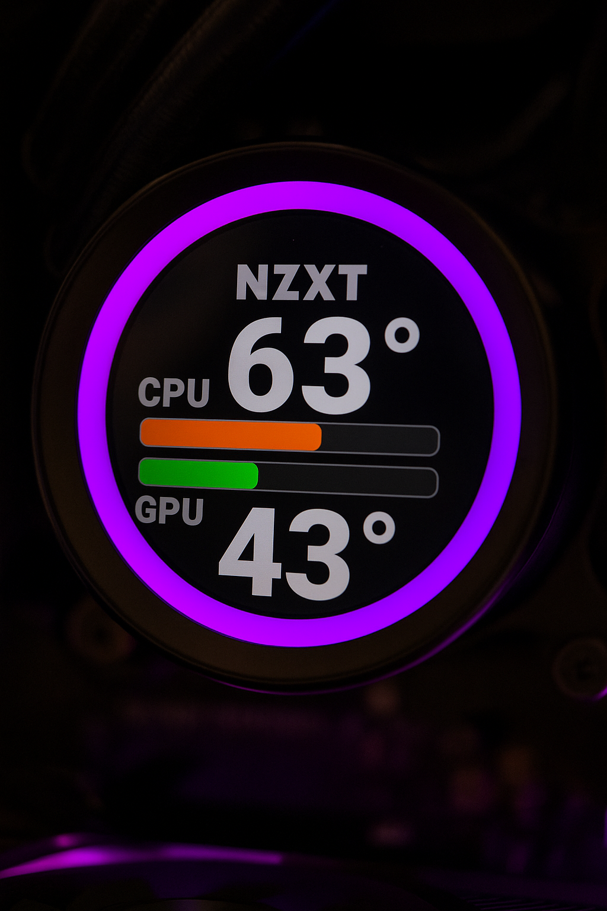
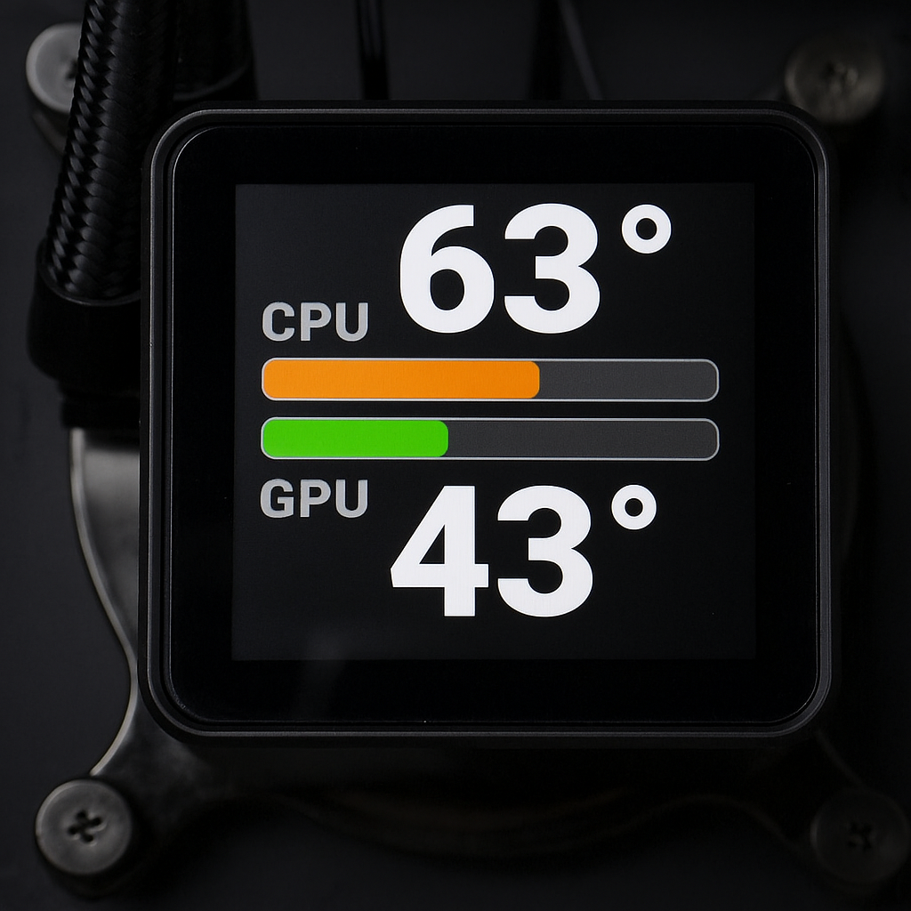

[](LICENSE)
[](https://en.wikipedia.org/wiki/C99)
[](https://kernel.org/)
[](https://aur.archlinux.org/packages/coolerdash-git)
[](https://github.com/damachine/coolerdash/issues)
[](https://github.com/sponsors/damachine)

# CoolerDash - Extends [CoolerControl](https://gitlab.com/coolercontrol/coolercontrol) with a polished LCD dashboard

## 📖 Description

**CoolerDash is a wrapper tool that extends CoolerControl. Turn your water cooling display into a smart, stylish information hub—beyond the default features of CoolerControl alone.**

Special thanks to @codifryed, the developer of CoolerControl!

### 📸 Screenshot – Example LCD Output

<div align="center">
  
  
  
</div>

---

## 🖥️ System Requirements

- **OS**: Linux
- **CoolerControl**: REQUIRED - must be installed and running
- **CPU**: x86-64-v3 compatible (Intel Haswell+ 2013+ / AMD Excavator+ 2015+)
- **LCD**: LCD displays supported by CoolerControl (NZXT, etc.)

**For older CPUs**: Use `CFLAGS=-march=x86-64 make` for compatibility

**Supported Distributions and Dependencies:**
- **Arch Linux / Manjaro (Recommended)**
- **Ubuntu / Debian**
- **Fedora**
- **RHEL / CentOS**
- **openSUSE**

> **Note:** If you install manually, you must ensure all required dependencies are installed yourself. No automatic updates will be provided for manual installations.

## Prerequisites

1. **Install CoolerControl**: [Installation Guide](https://gitlab.com/coolercontrol/coolercontrol/-/blob/main/README.md)
2. **Start CoolerControl daemon**: `systemctl start coolercontrold`
3. **In CoolerControl config - Device and Sensor - select one sensor for CPU and GPU**

---

## 📦 Installation

### Install CoolerDash

#### Arch Linux (Recommended)

- Using an AUR helper (recommended):
```bash
yay -S coolerdash-git
```

- Manual AUR install (no AUR helper):
```bash
# STEP 1: Clone repository
git clone https://aur.archlinux.org/coolerdash-git.git
cd coolerdash-git
makepkg --printsrcinfo > .SRCINFO
makepkg -si

# STEP 2: Start CoolerControl daemon if not already running
systemctl start coolercontrold

# STEP 4: Enable autostart and start CoolerDash
systemctl enable --now coolerdash.service

# STEP 5: (optional) Check CoolerDash service status
systemctl status coolerdash.service
journalctl -u coolerdash.service
```

#### All Distributions (Manual Installation)

```bash
# STEP 1: Clone repository
git clone https://github.com/damachine/coolerdash.git
cd coolerdash

# STEP 2: Start CoolerControl daemon if not already running
systemctl start coolercontrold

# STEP 3: Build and install (auto-detects Linux distribution and installs dependencies)
sudo make install

# STEP 4: Enable autostart
systemctl enable --now coolerdash.service

# STEP 5: (optional) Check CoolerDash service status
systemctl status coolerdash.service
journalctl -u coolerdash.service
```

---

#### Manual Usage 

```bash
# Run manually (with minimal status logging)
coolerdash

# Run with detailed debug logging
coolerdash --log

# Or use full path
/opt/coolerdash/bin/coolerdash

# From directory
./coolerdash
```
> **Note:** The systemd service must be stopped before running manually to avoid conflicts:
```bash
systemctl stop coolerdash.service
```

---

## ⚙️ Configuration

> **CoolerControl configuration**: In CoolerControl GUI, set CPU/GPU sensors to your desired values!
>                                  In CoolerControl GUI, set your LCD display to **"Image/gif"** mode and brightness to **"80%"**! 

> **Runtime Configuration:** All settings are managed in `/etc/coolerdash/config.ini`.
> After editing the config file, restart the service with `systemctl restart coolerdash.service` to apply your changes.

> **Shutdown Image:** When CoolerDash stops (during system shutdown or reboot), it automatically displays the `shutdown.png` image since sensor data is no longer available. You can customize, disable, or replace this image by editing the `/etc/coolerdash/config.ini` configuration file.

---

## 🔧 Usage

#### Service Management

```bash
# Service control
systemctl start coolerdash.service     # Start
systemctl stop coolerdash.service      # Stop (displays face.png automatically)
systemctl restart coolerdash.service   # Restart
systemctl status coolerdash.service    # Status + recent logs

# Journal log
journalctl -u coolerdash.service

# Live logs
journalctl -u coolerdash.service -f
```

#### Build Commands

```bash
make            # Standard C99 build
make clean      # Clean up
make install    # System installation with dependency auto-detection
make uninstall  # Remove installation (service, binary, files)
make debug      # Debug build with AddressSanitizer
make help       # Show all options
```

#### Debugging Steps

```bash
# 1. Check CoolerControl status
systemctl status coolercontrold
curl http://localhost:11987/devices

# 2. Test CoolerDash manually (with clean output)
coolerdash

# 3. Test CoolerDash with detailed debug logging
coolerdash --log

# 4. Debug build for detailed information (if needed)
make debug && coolerdash --log

# 5. Check service logs (STATUS messages always visible)
journalctl -u coolerdash.service -f

# 6. View recent logs with context
journalctl -u coolerdash.service -n 50
```

## 🔍 Troubleshooting

#### Common Issues

- **"Device not found"**: LCD not configured in CoolerControl → Use CoolerControl GUI → set LCD mode to `Image/gif` 
- **"Connection refused"**: CoolerControl daemon not running → `systemctl start coolercontrold`
- **"Connection problem"**: No devices found or wrong device UID → Check CoolerControl configuration and LCD connection → Verify with `curl http://localhost:11987/devices | jq`

**Troubleshooting: Verify connection**, you can manually check if devices are detected correctly:
```bash
# Start CoolerControl (if not running)
systemctl start coolercontrold

# Check available devices
curl http://localhost:11987/devices | jq
```

**Example CoolerControl API output:**
```json
{
      "name": "NZXT Kraken 2023",
      "type": "Liquidctl",
      "type_index": 1,
      "uid": "8d4becb03bca2a8e8d4213ac376a1094f39d2786f688549ad3b6a591c3affdf9",
      "lc_info": {
        "driver_type": "KrakenZ3",
        "firmware_version": "2.0.0",
        "unknown_asetek": false
      }
```

**Manual Installation Conflicts**
If you see errors like "conflicting files" or "manual installation detected" during `makepkg -si`, this means CoolerDash was previously installed manually (via `make install`).

**Solution:**
- The PKGBUILD will attempt to clean up automatically.
- If problems persist, run:
  ```
  sudo make uninstall
  ```
- Remove any leftover files in `/opt/coolerdash/`, `/usr/bin/coolerdash`, and `/etc/systemd/system/coolerdash.service`.
- Then retry the installation.

If you need help, open an issue at https://github.com/damachine/coolerdash/issues

---

## ⚠️ Disclaimer

This software is provided "as is", without warranty of any kind, express or implied.  
I do not guarantee that it will work as intended on your system.  

## 📄 License

MIT License - See LICENSE file for details.

## 💝 Support the Project

If you find CoolerDash useful and want to support its development:

- ⭐ **Star this repository** on GitHub
- 🐛 **Report bugs** and suggest improvements
- 🔄 **Share** the project with others
- 📝 **Contribute** code or documentation
- [](https://github.com/sponsors/damachine)

> *All donations help maintain and improve this project. Thank you for your support!*

---

**👨‍💻 Developed by DAMACHINE**
**📧 Contact:** [christkue79@gmail.com](mailto:christkue79@gmail.com)
**🌐 Repository:** [GitHub](https://github.com/damachine/coolerdash)
**💝 Donate:** BTC: `13WjpWQMGG5sg3vTJJnCX3cXzwf2vZddKo`
