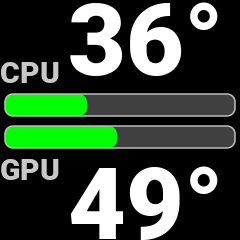
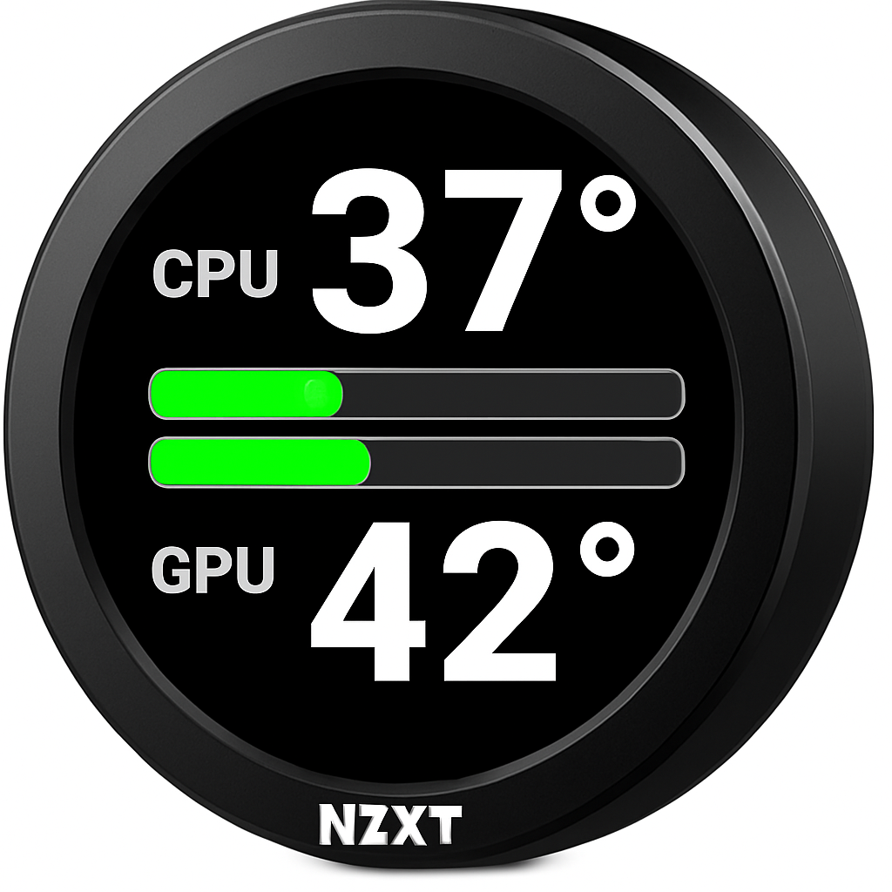

[](LICENSE)
[](https://en.wikipedia.org/wiki/C99)
[](https://kernel.org/)
[](bitcoin:13WjpWQMGG5sg3vTJJnCX3cXzwf2vZddKo)
[](https://dogechain.info/address/DRSY4cA8eCALn819MjWLbwaePFNti9oS3y)

# CoolerDash - LCD dashboard for CoolerControl

## 📖 Description

**Take full control of your liquid cooling system with integrated LCD display to monitor real-time sensor data in style.**

This system daemon empowers you to harness the potential of your LCD-equipped liquid coolers. Display comprehensive system monitoring data including CPU and GPU temperatures directly on your LCD screen through seamless CoolerControl Open-API integration.

Transform your cooling system into an intelligent monitoring hub that keeps you informed about your system's vital signs at a glance.

Special thanks to @codifryed, the developer of CoolerControl, for making this possible!

---

### 📸 Screenshot – Example LCD Output

<div align="center">
  
  
</div>

*Left: Live temperature monitoring image on NZXT Kraken 2023 LCD display  
Right: AI-generated image to demonstrate LCD output*

**👨‍💻 Author:** DAMACHINE ([christkue79@gmail.com](mailto:christkue79@gmail.com))  
**🧪 Tested with:** NZXT Kraken 2023 (Z-Series) - Developer's personal system  
**🔗 Compatible:** NZXT Kraken X-Series, Z-Series and other LCD-capable models (Asus, MSI, NZXT, etc.)*(theoretical)*

## ✨ Features

- **🚀 Intelligent Installation**: Easy installation for all major Linux distributions
- **⚡ Performance-Optimized**: Caching, change detection, minimal I/O operations
- **📊 Efficient Sensor Polling**: Only necessary sensor data is queried (no mode logic)
- **📊 CoolerControl Open-API**: Complete device and sensor data access via CoolerControl Open-API
- **🔄 Systemd Integration**: Service management with detailed logs
- **🔒 Enhanced Security**: Runs as dedicated non-root user for improved system security

> **Note:** Support for selectable display modes may be reintroduced in a future version if there is sufficient demand 🎨.

### 🖥️ System Requirements

- **OS**: Linux
- **CoolerControl**: REQUIRED - must be installed and running
- **CPU**: x86-64-v3 compatible (Intel Haswell+ 2013+ / AMD Excavator+ 2015+)
- **LCD**: LCD displays supported by CoolerControl (Asus, MSI, NZXT, etc.)

**For older CPUs**: Use `CFLAGS=-march=x86-64 make` for compatibility

**Supported Distributions and Dependencies:**
- **Arch Linux / Manjaro (Recommended)**
- **Ubuntu / Debian**
- **Fedora**
- **RHEL / CentOS**
- **openSUSE**

> **Note:** Dependencies are usually installed automatically when using the provided PKGBUILD or package manager scripts.  
> If you install manually, please ensure all required dependencies are present on

### Prerequisites

1. **Install CoolerControl**: [Installation Guide](https://gitlab.com/coolercontrol/coolercontrol/-/blob/main/README.md)
2. **Start CoolerControl daemon**: `systemctl start coolercontrold`
3. **CoolerControl configuration**: In CoolerControl GUI, set your LCD display to **"Image/gif"** mode!

## 📦 Installation

### Install CoolerDash

#### Arch Linux (Recommended)

```bash
# STEP 1: Clone repository
git clone https://github.com/damachine/coolerdash.git
cd coolerdash

# STEP 2: Start CoolerControl daemon if not already running
systemctl start coolercontrold

# STEP 3: Build and install (includes automatic dependency management)
makepkg -si

# STEP 4: Enable autostart and start CoolerDash
systemctl enable --now coolerdash.service

# STEP 5: (optional) Check CoolerDash service status
systemctl status coolerdash.service
journalctl -u coolerdash.service
```

#### Manual Installation (All Distributions)

```bash
# STEP 1: Clone repository
git clone https://github.com/damachine/coolerdash.git
cd coolerdash

# STEP 2: Start CoolerControl daemon if not already running
systemctl start coolercontrold

# STEP 3: Build and install (auto-detects Linux distribution and installs dependencies)
sudo make install

# STEP 4: Enable autostart
systemctl enable --now coolerdash.service

# STEP 5: (optional) Check CoolerDash service status
systemctl status coolerdash.service
journalctl -u coolerdash.service
```

### Manual Usage 

```bash
# Run manually
coolerdash

# Or use full path
/opt/coolerdash/bin/coolerdash

# From directory
./coolerdash
```
> **Note:** The systemd service must be stopped before running manually to avoid conflicts:
```bash
systemctl stop coolerdash.service
```

## ⚙️ Configuration

> **The following settings were tested with an NZXT Kraken 2023.**  
> CoolerDash should work with any LCD device supported by CoolerControl (Asus, MSI, NZXT, etc.).

> **Note:** CoolerDash automatic detect most essentiality settings and no configuration are need. All relevant configuration options (display, thresholds, font, colors, paths, daemon and many more settings) are set in `/etc/coolerdash/config.ini`. 
> After editing the config file, restart the service with `systemctl restart coolerdash.service` to apply your changes.
> **Tip:** Edit `/etc/coolerdash/config.ini` to change the look, update interval, thresholds, or LCD behavior to your needs.

> **If `/etc/coolerdash/config.ini` does not exist, CoolerDash will use built-in defaults.**

---

### Important customizable values


### 🔧 Usage & Tips

# Service Management

```bash
# Service control
systemctl start coolerdash.service     # Start
systemctl stop coolerdash.service      # Stop (displays face.png automatically)
systemctl restart coolerdash.service   # Restart
systemctl status coolerdash.service    # Status + recent logs

# Journal log
journalctl -u coolerdash.service

# Live logs
journalctl -u coolerdash.service -f

# Makefile shortcuts
make start      # systemctl start coolerdash
make stop       # systemctl stop coolerdash
make status     # systemctl status coolerdash
make logs       # journalctl -u coolerdash -f
```

### Build Commands

```bash
make            # Standard C99 build
make clean      # Clean up
make install    # System installation with dependency auto-detection
make uninstall  # Remove installation (service, binary, files)
make debug      # Debug build with AddressSanitizer
make help       # Show all options
```

### Debugging Steps

```bash
# 1. Check CoolerControl status
systemctl status coolercontrold
curl http://localhost:11987/devices

# 2. Test CoolerDash manually
coolerdash

# 3. Debug build for detailed information
make debug && coolerdash

# 4. Check service logs
journalctl -u coolerdash.service -f
```

## 🔍 Troubleshooting

### Common Issues

- **"Device not found"**: LCD not configured in CoolerControl → Use CoolerControl GUI → set LCD mode to `Image/gif` 
- **"Connection refused"**: CoolerControl daemon not running → `systemctl start coolercontrold`
- **"Connection problem"**: No devices found or wrong device UID → Check CoolerControl configuration and LCD connection → Verify with `curl http://localhost:11987/devices | jq`
- **"Another instance may be running"**: CoolerDash is already running → Check with `systemctl status coolerdash.service` and stop the service if needed

**Troubleshooting: Verify connection**, you can manually check if devices are detected correctly:
```bash
# Start CoolerControl (if not running)
systemctl start coolercontrold

# Check available devices
curl http://localhost:11987/devices | jq
```

**Example CoolerControl API output:**
```json
{
      "name": "NZXT Kraken 2023",
      "type": "Liquidctl",
      "type_index": 1,
      "uid": "8d4becb03bca2a8e8d4213ac376a1094f39d2786f688549ad3b6a591c3affdf9",
      "lc_info": {
        "driver_type": "KrakenZ3",
        "firmware_version": "2.0.0",
        "unknown_asetek": false
      }
```

## Troubleshooting: Manual Installation Conflicts
If you see errors like "conflicting files" or "manual installation detected" during `makepkg -si`, this means CoolerDash was previously installed manually (via `make install`).

**Solution:**
- The PKGBUILD will attempt to clean up automatically.
- If problems persist, run:
  ```
  sudo make uninstall
  ```
- Remove any leftover files in `/opt/coolerdash/`, `/usr/bin/coolerdash`, and `/etc/systemd/system/coolerdash.service`.
- Then retry the installation.

If you need help, open an issue at https://github.com/damachine/coolerdash/issues

## 📄 License

MIT License - See LICENSE file for details.

## 💝 Support the Project

If you find CoolerDash useful and want to support its development:

### 🪙 Cryptocurrency Donations:
- **Bitcoin (BTC)**: `13WjpWQMGG5sg3vTJJnCX3cXzwf2vZddKo`
- **Dogecoin (DOGE)**: `DRSY4cA8eCALn819MjWLbwaePFNti9oS3y`

### 🤝 Other Ways to Support:
- ⭐ **Star this repository** on GitHub
- 🐛 **Report bugs** and suggest improvements  
- 🔄 **Share** the project with others
- 📝 **Contribute** code or documentation

> *All donations help maintain and improve this project. Thank you for your support!*

---

**👨‍💻 Developed by DAMACHINE for maximum efficiency and stability.**  
**📧 Contact:** [christkue79@gmail.com](mailto:christkue79@gmail.com)  
**📖 Manual:** `man coolerdash`  
**📍 Binary:** `/opt/coolerdash/bin/coolerdash` (also available as `coolerdash`)  
**⚙️ Config:** `/etc/coolerdash/config.ini`  
**💝 Donate:** BTC: `13WjpWQMGG5sg3vTJJnCX3cXzwf2vZddKo` | DOGE: `DRSY4cA8eCALn819MjWLbwaePFNti9oS3y`
