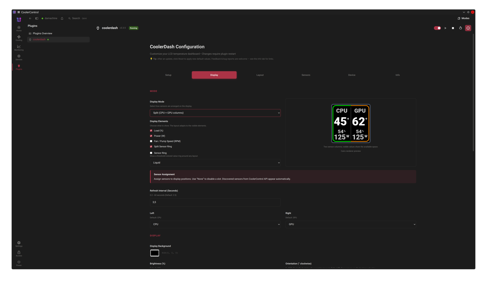

<p align="left">
  <a href="https://opensource.org/licenses/MIT"></a>
  <a href="https://en.wikipedia.org/wiki/C99"></a>
  <a href="https://kernel.org/"></a>
  <a href="https://github.com/damachine/coolerdash/actions/workflows/github-code-scanning/codeql"></a>
</p>

# CoolerDash

### Linux LCD telemetry for supported AIO liquid coolers through CoolerControl, tested on multiple NZXT Kraken models.

**Display real-time CPU, GPU, and liquid temperatures with customizable layouts directly on your cooler's LCD.**

## Features
- **Plug-In that extends the LCD functionality of [CoolerControl](https://gitlab.com/coolercontrol/coolercontrol)**
- **Support for additional sensor values (CPU/GPU/Liquid)**
- **Integrated UI for customizing all settings**  
- **Display modes**

### Split Mode

**Default:** Shows CPU and GPU in two compact columns.

<p align="left">
  &nbsp;&nbsp;&nbsp;
  &nbsp;&nbsp;&nbsp;
  
</p>

### Dual Mode

Shows CPU and GPU temperatures with bars.

<p align="left">
  &nbsp;&nbsp;&nbsp;
  &nbsp;&nbsp;&nbsp;
  
</p>

### Circle Mode

**Beta:** Alternates between configured sensor slots.

<p align="left">
  &nbsp;&nbsp;&nbsp;
  &nbsp;&nbsp;&nbsp;
  
</p>

> **Officially listed by CoolerControl as a [2nd Party (Trusted) Plugin](https://docs.coolercontrol.org/automation/plugins.html#_2nd-party-trusted-plugins).**  
> Special thanks to [@codifryed](https://github.com/codifryed), the founder of CoolerControl.

Join the CoolerDash channel on the official CoolerControl Discord:

<a href="https://discord.com/channels/908873022105079848/1461781766791499981"></a>

## System Requirements

- **OS**: Linux (systemd or openrc)
- **CoolerControl**: Version >=3.1.0 REQUIRED - must be installed and running [Installation Guide](https://gitlab.com/coolercontrol/coolercontrol/-/blob/main/README.md)
- **CPU**: x86-64
- **LCD**: AIO liquid cooler LCD displays **(NZXT, etc.)**

> See the [Supported Devices](https://github.com/damachine/coolerdash/blob/master/docs/devices.md) for confirmed working hardware. In principle, all devices supported by CoolerControl/[liquidctl](https://github.com/liquidctl/liquidctl?tab=readme-ov-file#supported-devices) should work with CoolerDash. You can [submit a device confirmation](https://github.com/damachine/coolerdash/issues/new?template=device-confirmation.yml) to help expand the list.

## Installation

### Arch-based distributions

[](https://aur.archlinux.org/packages/coolerdash-git)

```bash
# Install with an AUR helper
yay -S coolerdash-git
#OR any other AUR helper
```

**Pre-built packages:**

[](https://github.com/damachine/coolerdash/releases/latest)
[](https://github.com/damachine/coolerdash/releases/latest)
[](https://github.com/damachine/coolerdash/releases/latest)
[](https://github.com/damachine/coolerdash/releases/latest)

### Manual installation

```bash
# STEP 1: Clone repository
git clone https://github.com/damachine/coolerdash.git
cd coolerdash

# STEP 2: Install dependencies, build, and install
sudo make install
```

> For manual installations, make sure all required dependencies are installed correctly. Manual installations need to be updated manually.

## Configuration

**Required: Access Token**

1. In CoolerControl, open **Access Protection → Access Tokens**.
2. Create a token with **Write Access** enabled (for example, named `coolerdash`) and copy it.
3. Open **Plugins → CoolerDash → Connection**, paste it into **Access Token**, and save.

> CoolerDash only reads sensor data and does not change sensor settings. Write Access is required solely to update the LCD through CoolerControl. See the [CoolerControl access token documentation](https://docs.coolercontrol.org/daemon/access-protection.html#access-tokens).

**Optional:** Customize other settings in the CoolerDash UI.



## Hardware Reports

<details>
  <summary>Expand</summary>

## Usage

If an AIO LCD is unsupported or only partially working, create a sanitized
hardware report:

~~~bash
coolerdash --hardware-report
~~~

CoolerDash writes a JSON report and a Markdown summary to your home directory.
Nothing is uploaded automatically. Review both files before attaching the JSON
and pasting the Markdown summary into a
[Device Confirmation Issue](https://github.com/damachine/coolerdash/issues/new?template=device-confirmation.yml).

An optional LCD test is available when no other CoolerDash instance is running:

~~~bash
coolerdash --hardware-report --test-lcd
~~~

The test requires an explicit **TEST** confirmation, temporarily displays a test
image with geometry guides, records the visible panel shape and centering, and
then restores the previous LCD settings. For a new or unknown LCD model, use
this form so the report contains enough evidence for a display profile.

Advanced overrides:

```bash
coolerdash --hardware-report --output-dir /path/to/reports
coolerdash --hardware-report --test-lcd --device DEVICE_UID
coolerdash --hardware-report /custom/config.json
```

The report omits access tokens, serial numbers, raw device UIDs, host/user names,
IP addresses, and personal paths. It includes sanitized CoolerControl and
liquidctl metadata plus matching USB device, interface, and endpoint
descriptors. These descriptors identify available HID/bulk paths but do not
capture USB traffic or reveal an unknown pixel protocol.
</details>

## Advanced Usage

<details>
  <summary>Expand</summary>

### Build Commands

```bash
make            # Standard C99 build
make clean      # Clean up
make install-deps       # Install dependencies only
sudo make install       # Install dependencies, build, and install
sudo make uninstall     # Remove the program and preserve user data
make debug      # Debug build with AddressSanitizer
make help       # Show all options
```

### Debugging

```bash
# 1. Check CoolerControl status
systemctl status coolercontrold
# or on OpenRC:
rc-service coolercontrold status
curl http://localhost:11987/devices

# 2. Test CoolerDash manually (with clean output)
/usr/libexec/coolerdash/coolerdash

# 3. Test CoolerDash with detailed verbose logging
/usr/libexec/coolerdash/coolerdash --verbose
# or short form:
/usr/libexec/coolerdash/coolerdash -v

# 4. Debug build and installation (recommended)
# Option A — Build as your user, then install the ASan binary:
make debug
sudo make install

# Option B — Build as your user and install the debug binary manually (recommended):
make clean && make debug
sudo install -Dm755 bin/coolerdash /usr/libexec/coolerdash/coolerdash

# Notes:
#  • Run `make clean && make` to switch from a debug build back to a normal build.
#  • If you previously built as root and own files are root-owned, fix ownership before rebuilding:
#    sudo chown -R $USER:$USER build bin

# 5. Check plugin logs (STATUS messages always visible)
journalctl -xeu coolercontrold.service -f
# On OpenRC, inspect your configured system logger for CoolerControl/coolerdash output.

# 6. View recent logs with context
journalctl -u coolercontrold.service -n 50
```
</details>

## Troubleshooting

<details>
  <summary>Expand</summary>

### Installation Issues
If you see errors like "conflicting files" or "manual installation detected" during Arch/AUR `makepkg -si`, CoolerDash was previously installed manually via `make install`.

**Solution:**
```bash
sudo make uninstall
```

### Check CoolerControl devices is detected

```bash
liquidctl --version
# Expected: liquidctl v1.15.0 (or newer)
```

```bash
liquidctl --list
# Expected: Device #0: NZXT Kraken 2023
```

  ```bash
  curl http://localhost:11987/devices | jq
  ```

  ```json
  {
        "name": "NZXT Kraken 2023",
        "type": "Liquidctl",
        "type_index": 1,
        "uid": "8d4becb03bca2a8e8d4213ac376a1094f39d2786f688549ad3b6a591c3affdf9",
        "lc_info": {
          "driver_type": "KrakenZ3",
          "firmware_version": "2.0.0",
          "unknown_asetek": false
        }
  }
  ```
</details>

## Documentation

<details>
  <summary>Expand</summary>

- **[Configuration Guide](https://github.com/damachine/coolerdash/blob/master/docs/config-guide.md)** - All configuration options
- **[Supported Devices](https://github.com/damachine/coolerdash/blob/master/docs/devices.md)** - Confirmed working hardware
- **[Display Modes Guide](https://github.com/damachine/coolerdash/blob/master/docs/display-modes.md)** - Dual, Split, and Circle mode reference
- **[Developer Guide](https://github.com/damachine/coolerdash/blob/master/docs/developer-guide.md)** - Architecture and API integration
- **[Display Detection](https://github.com/damachine/coolerdash/blob/master/docs/display-detection.md)** - Display shape detection
- **[CoolerControl API Guide](https://github.com/damachine/coolerdash/blob/master/docs/coolercontrol-api.md)** - API module documentation
</details>

## Community & Support

<a href="https://github.com/damachine/coolerdash/discussions"></a> <a href="https://github.com/damachine/coolerdash/issues"></a> <a href="https://discord.com/channels/908873022105079848/1461781766791499981"></a>

**Support the project:**

<p align="left">
  <a href="https://github.com/damachine/coolerdash/stargazers"></a>
  <a href="https://github.com/sponsors/damachine"></a>
</p>
