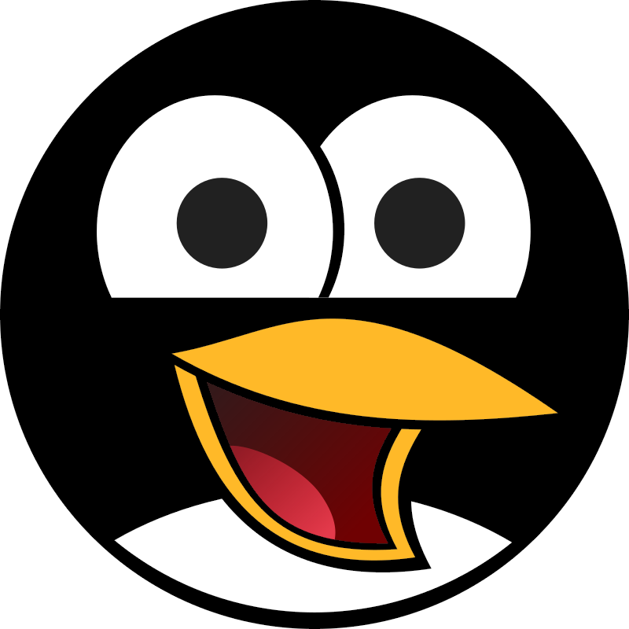

# Plugin Integration

CoolerDash runs as an unprivileged integration plugin. CoolerControl manages its
service lifecycle automatically; no separate service setup is needed.

## Authentication

Create a token with Write Access under CoolerControl's Access Protection, then
save it under Plugins > CoolerDash > Connection. CoolerDash persists the token
with restricted permissions in `credentials.json`; `config.json` only contains
the `***` sentinel after the token has been saved.

## Shutdown Image

Registered once at startup through CoolerControl's shutdown-image API:

```
PUT /devices/{uid}/settings/lcd/{channel}/shutdown-image
```

CoolerControl stores the image and displays it when it stops. Configure a custom
shutdown image via `paths.image_shutdown`, or keep the default file at
`/var/lib/coolercontrol/plugins/coolerdash/shutdown.png`.

CoolerDash detects PNG, GIF, JPEG, BMP, and TIFF files by content and sends the
matching MIME type. Animated GIF support depends on the LCD device and driver.



## Plugin UI

Theme-adaptive UI using CoolerControl CSS variables + Tailwind CSS + PrimeIcons.

### CSS Variables

```css
--colors-bg-one       /* Primary background */
--colors-bg-two       /* Secondary background */
--colors-border-one   /* Border color */
--colors-text         /* Text color */
--colors-accent       /* Accent color */
```

### Manifest

```toml
version = "{{VERSION}}"
privileged = false
url = "https://github.com/damachine/coolerdash"
```

Displayed on the CoolerControl plugin page.

## Settings UI Sections

- Daemon: API address, access token
- Display: Mode, refresh interval, brightness, orientation
- Advanced: Display dimensions

## Related

- [Configuration Guide](config-guide.md)
- [Plugin UI Theming](plugin-ui-theming.md)
- [CoolerControl Custom Device Plugin](https://gitlab.com/coolercontrol/cc-plugin-custom-device)
